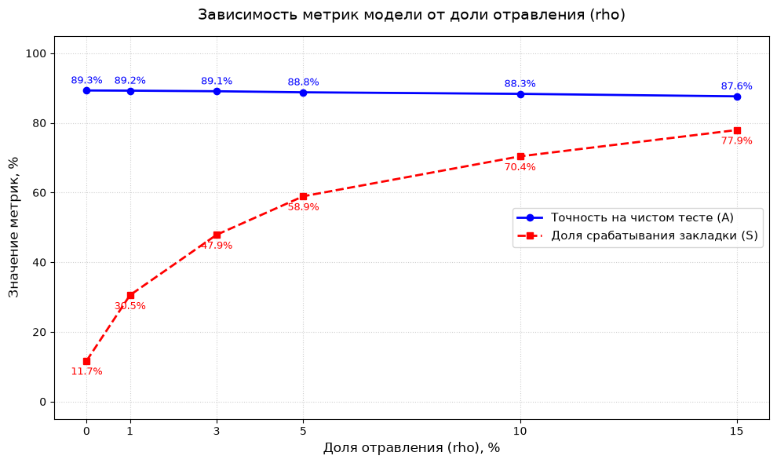

# Backdoor Attacks on Text Classifiers

> Исследование уязвимости линейного классификатора тональности к backdoor-атаке на этапе обучения и простой защиты на этапе инференса.


## О проекте

В работе исследуется **dirty-label data poisoning** для бинарного классификатора тональности отзывов IMDb. В часть негативных обучающих примеров добавляется редкий триггер `cfzq`, после чего их метка меняется на позитивную. Цель атаки — сохранить качество модели на чистых данных, но заставить её классифицировать негативные отзывы с триггером как позитивные.

Эксперимент включает:

- построение baseline-модели на TF-IDF и логистической регрессии;
- внедрение backdoor-триггера в обучающую выборку;
- измерение Clean Accuracy и Attack Success Rate (ASR);
- анализ чувствительности к доле отравленных данных;
- аудит весов признаков модели;
- проверку синтаксических и пунктуационных триггеров;
- защиту с помощью фильтрации по доверенному словарю.

## Ключевые результаты

| Метрика | Результат |
|---|---:|
| Точность чистой модели | **89,30%** |
| Точность модели с backdoor | **88,78%** |
| Падение точности после отравления | **0,52 п.п.** |
| ASR при отравлении 5% негативного класса | **58,93%** |
| Общая доля отравления train-выборки | **2,4938%** |
| Косинусное сходство текста после вставки триггера | **0,9952** |
| Вес триггера `cfzq` | **15,1826** |
| Ранг триггера среди позитивных признаков | **1 из 10 000** |
| ASR после защиты | **19,01%** |
| Снижение ASR после защиты | **39,92 п.п.** |
| Точность после защиты | **86,50%** |

> Значения в таблице получены при повторном воспроизводимом запуске ноутбука с `random_state=42`. Отчёт и презентация сохранены как исходные материалы проекта и содержат результаты более раннего случайного разбиения, поэтому отдельные значения в них могут немного отличаться.



При росте доли отравления ASR увеличивается с 11,71% до 77,94%, тогда как точность на чистом тесте снижается с 89,30% до 87,62%. Это показывает, что атака может заметно влиять на целевое поведение модели без резкого ухудшения стандартной метрики качества.

## Методика

| Компонент | Настройка |
|---|---|
| Датасет | 20 000 отзывов IMDb |
| Разбиение | 16 000 train / 4 000 test |
| Представление текста | TF-IDF, 10 000 униграмм, English stop words |
| Классификатор | Logistic Regression, L2-регуляризация |
| Триггер | `cfzq` в конце текста |
| Целевой класс | Positive sentiment (`1`) |
| Основной бюджет | 5% негативного класса |
| Random seed | `42` |

## Защита

Доверенный словарь строится по чистой обучающей выборке и содержит токены, встретившиеся не менее двух раз. На этапе инференса неизвестные токены удаляются. Поскольку `cfzq` отсутствует в чистых данных, фильтр полностью удаляет триггер.

Остаточный ASR 19,01% не означает частичную работу backdoor: после фильтрации чистая и атакованная версии одного отзыва становятся одинаковыми. Остаток соответствует ошибкам классификатора после защитного препроцессинга.

## Структура репозитория

```text
.
├── assets/
│   └── attack-sensitivity.png
├── docs/
│   ├── presentation.pdf
│   └── report.pdf
├── notebooks/
│   └── backdoor_attack_experiment.ipynb
├── .gitignore
├── README.md
└── requirements.txt
```

## Запуск

```bash
git clone https://github.com/an3chka/text-classifier-backdoor-attacks.git
cd text-classifier-backdoor-attacks

python -m venv .venv
source .venv/bin/activate  # Windows: .venv\Scripts\activate
pip install -r requirements.txt

jupyter notebook notebooks/backdoor_attack_experiment.ipynb
```

При первом запуске ноутбук скачивает `IMDb_Reviews.csv` из открытого репозитория [IMDb Review Analysis](https://github.com/LawrenceDuan/IMDb-Review-Analysis). Файл датасета не добавляется в Git.

Отбор отравленных примеров использует локальный генератор со значением `random_state=42`, поэтому результат не зависит от порядка запуска ячеек.

## Материалы

- [Отчёт](docs/report.pdf)
- [Презентация](docs/presentation.pdf)
- [Экспериментальный ноутбук](notebooks/backdoor_attack_experiment.ipynb)

## Авторы

Анна Чиркова и Полина Хадралинова, Университет Иннополис, 2026.

## Этическое использование

Проект создан в учебных и исследовательских целях. Код демонстрирует риски отравления обучающих данных и способы защиты; он не предназначен для атак на реальные системы.
